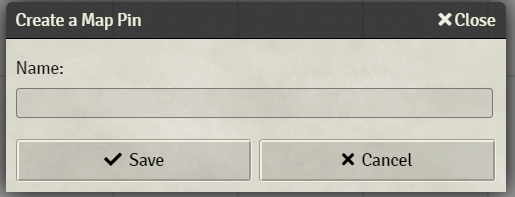

# Pin Cushion


[](https://forge-vtt.com/bazaar#package=pin-cushion)


[](https://www.foundryvtt-hub.com/package/pin-cushion/)


Adds additional functionality around Map Pins


### NOTE

In compliance with the licenses, some piece of code of some feature has been inserted by other projects that I describe in detail in the "Credits" department of this README, **I invite you to support these developers**.

My aim is not to take credit for their work, I just don't want to install 100 modules for 100 features which then collide with each other, every single external feature can be disabled in the settings of this module to allow the use of modules between them .

## Installation

It's always easiest to install modules from the in game add-on browser.

To install this module manually:
1.  Inside the Foundry "Configuration and Setup" screen, click "Add-on Modules"
2.  Click "Install Module"
3.  In the "Manifest URL" field, paste the following url:
`https://raw.githubusercontent.com/p4535992/foundryvtt-pin-cushion/master/module.json`
4.  Click 'Install' and wait for installation to complete
5.  Don't forget to enable the module in game using the "Manage Module" button

## Known issue

## Note: About the transition form 1.5.0 to 1.7.0 [here you can find all the details](./wiki/md/table_feature_150_to_170.md)

### libWrapper

This module uses the [libWrapper](https://github.com/ruipin/fvtt-lib-wrapper) library for wrapping core methods. It is a hard dependency and it is recommended for the best experience and compatibility with other modules.

## Settings

- **Force to show notes**: Automatically flag journal notes to show on the map without having to have your players turn it on themselves.

- **Preview Maximum Length**: **TEXT PREVIEW ONLY** How many characters should the text preview show?

- **Preview Delay**: How long before preview appears (in milliseconds)

- **Default Journal Entry Permission**: The default permission journal entries will be created with

- **Default Journal Entry Folder**: The default folder journal entries will be created in when creating Map Pins with a double-click

- **Show by default the icon image of the journal on the map note**: If a image is set on the journal by default is the first image set from Pin Cushion

- **Enable Player-Only Icons by default**: Newly created notes will have player-only icons enabled automatically.

- **Default Note Icon for Players**: The default icon used for player-only icons

- **GM Label**: Add the ability for Note tooltips to be configured so that GMs see different text to Players. So secret information can be displayed to GMs whilst players see the 'public' information about the Note.

- **Enable revealed state on scene Notes**: When enabled, then the 'revealed' state will be used to determine if the Note is visible to players. (The default Foundry VTT behavior is for Notes to be visible to players only if the linked document is accessible by the player.)

- **[Only if setting 'Enable revealed state on scene Notes.' is enabled] Set the tint color of the Note revealed state on scene Notes**: Is an option to set the tint color of the Note icon to indicate if the linked document is reachable or not (if the Note has no linked document, then it will always be displayed in the 'unreachable' tint).

- **[Only if setting 'Enable revealed state on scene Notes.' is enabled] Note Tint Color when linked**: For PLAYERs, the RGB value to be used to tint scene Notes if they have a reachable link (if left blank then the tint, if any, will remain unchanged).  For GMs, this is the initial Icon Tint set during import.

- **[Only if setting 'Enable revealed state on scene Notes.' is enabled] Note Tint Color when not linked**: For PLAYERs, the RGB value to be used to tint scene Notes if they do not have a reachable link (if left blank then the tint, if any, will remain unchanged).  For GMs, this is the initial Icon Tint set during import.

- **Select Specific Folder**: Make sense only with the module setting 'Default Journal Entry Folder' set with value 'Specific folder'

- **Enable feature Backgroundless Pins**: If enabled this setting will let you with a additional checkbox 'Has Backgorund ?' on the note configuration panel remove or not the background box from map notes. WARNING: If you disable this module setting you simply have all your notes with background (the standard way), but the flags on the notes are not delete, so you can re-enable this when you want. YOU NEED TO REFRESH THE PAGE FOR APPLY THE SETTING.

- **Enable Sidebar Journal Images for GM Users**:

- **Enable Sidebar Journal Images for Player Users**:

- **[Only if setting 'Enable Sidebar Journal Images for GM Users' or 'Enable Sidebar Journal Images for Player Users' is enabled] Thumbnail Position**: Whether the thumbnail is left of the journal entry title or right.

- **Use mouse position for show the tooltip**: When you hover a note on the canvas the tooltip is build based on the current mouse position instead the journal icon position. This solution seem to be more dynamic.

- **One click note creation**: Create Notes directly on the Notes Layer with a simple left click without having a connected journal entry.

## Features

This module add many new settings for many use case on the Note config dialog, here some of the most interesting, but there is more:

- **Create Pin on canvas with double click**



- **Customized note configuration**


- **Journal preview on the sidebar**


- **Changes the dropdown of map pin icons into a filepicker so users can select any icons they like**
- **Adds the ability to double-click the canvas while on the Notes Layer and create a map pin (and corresponding Journal Entry)**
- **Adds a preview of the associated Journal Entry when you hover over a map pin**
- **Removes the background box from map notes**


- **Add the possibility to add a thumbnail preview of the journal**


- **[Only with setting 'Enable revealed state on scene Notes' enabled] Add an option to have a 'revealed' state on scene Notes:** When enabled, then the 'revealed' state will be used to determine if the Note is visible to players.
(The default Foundry VTT behaviour is for Notes to be visible to players only if the linked document is accessible by the player.)

- **[Only with setting 'Enable revealed state on scene Notes' enabled] Add an option to set the tint colour of the Note:** Icon to indicate if the linked document is reachable or not (if the Note has no linked document, then it will always be displayed in the "unreachable" tint).

- **[Only with setting 'Enable revealed state on scene Notes' enabled] Provide tint colours to allow GMs to see if notes have been revealed to players. Setting the tint to a blank string will remove this tinting.**

- **Add an option to hide the label text:** It will hide the label text when you hover on the note, it useful for avoid the "double" test given from the 'label' and 'title' attributes.

- **Add an option to always show the label text:** The label of the note is always visible without the need to go to _hover_ the note useful for note on a map or any use case.

- **Add an option to do not show Journal Preview:** Do not show the journal preview to the player can be useful in some case.

- **Add an option for setup the tooltip placement** (default: 'e') Placement location of the tooltip relative to the element it is open for. Values can be n, e, s, w, nw, ne, sw, se, nw-alt, ne-alt, sw-alt, or se-alt (as in north, east, south, and west). This only matters if followMouse is set to false.

- **Add an option for setup the tooltip stylish color**

- **Add an option for setup the tooltip smartplacement behaviour**:	(default: false) When enabled the plugin will try to keep tips inside the browser viewport. If a tooltip would extend outside of the viewport then its placement will be changed to an orientation that would be entirely within the current viewport.


- **Add an option for setup the _pin is transparent ?_ behaviour**: Now with a simple checkbox on the note configuration it is possible to make the icon transparent without wasting time looking for the transparent image file. Very useful for people who use maps with icons printed on the map and just want to show the tooltip when the cursor is over that image and it saves me a lot of time. NOTE: This configuration is applied only to the icon image of the note , not the image tooltip.

- **Add an option for setup the _Show only to GM ?_ behaviour**: Quite simply regardless of the associated permissions it shows the note only to the gm, it is very useful when used with this other module [Automatic Journal Icon Numbers](https://foundryvtt.com/packages/journal-icon-numbers) to prepare notes for the GM or random encounter with the Ironmonk modules, personally it saves me a lot of time in not continuously setting the permissions on the associated journal.

# Build

## Install all packages

```bash
npm install
```
## npm build scripts

### build

will build the code and copy all necessary assets into the dist folder and make a symlink to install the result into your foundry data; create a
`foundryconfig.json` file with your Foundry Data path.

```json
{
  "dataPath": "~/.local/share/FoundryVTT/"
}
```

`build` will build and set up a symlink between `dist` and your `dataPath`.

```bash
npm run-script build
```

### NOTE:

You don't need to build the `foundryconfig.json` file you can just copy the content of the `dist` folder on the module folder under `modules` of Foundry

### build:watch

`build:watch` will build and watch for changes, rebuilding automatically.

```bash
npm run-script build:watch
```

### clean

`clean` will remove all contents in the dist folder (but keeps the link from build:install).

```bash
npm run-script clean
```

### prettier-format

`prettier-format` launch the prettier plugin based on the configuration [here](./.prettierrc)

```bash
npm run-script prettier-format
```

### package

`package` generates a zip file containing the contents of the dist folder generated previously with the `build` command. Useful for those who want to manually load the module or want to create their own release

```bash
npm run-script package
```

## [Changelog](./changelog.md)

## Issues

Any issues, bugs, or feature requests are always welcome to be reported directly to the [Issue Tracker](https://github.com/p4535992/foundryvtt-pin-cushion/issues ), or using the [Bug Reporter Module](https://foundryvtt.com/packages/bug-reporter/).

## License

- [FVTT-Backgroundless-Pins](https://github.com/schultzcole/FVTT-Backgroundless-Pins) ([GPLv3 License](https://github.com/schultzcole/FVTT-Backgroundless-Pins/blob/master/LICENSE))
- [foundryvtt-journal-thumbnail](https://github.com/J-Guenther/foundryvtt-journal-thumbnail) ([MIT](https://github.com/J-Guenther/foundryvtt-journal-thumbnail/blob/main/LICENSE))
- [Point of Interest Teleporter](https://github.com/zeel01/poi-teleport) ([MIT](https://github.com/zeel01/poi-teleport/blob/master/LICENSE))
- [vtt-gmtext-in-notes](https://github.com/farling42/fvtt-gmtext-in-notes) ([MIT](https://github.com/farling42/fvtt-gmtext-in-notes/blob/master/LICENSE))
- [fvtt-revealed-notes-manager](https://github.com/farling42/fvtt-revealed-notes-manager) ([MIT](https://github.com/farling42/fvtt-revealed-notes-manager/blob/master/LICENSE))
- [journal-sidebar-images](https://github.com/jessev14/journal-sidebar-images) ([MIT](https://github.com/jessev14/journal-sidebar-images/blob/master/LICENSE))
- [jquery-powertip](https://github.com/stevenbenner/jquery-powertip) ([MIT](https://github.com/stevenbenner/jquery-powertip/blob/master/LICENSE.txt))
- [Pin Fixer](https://github.com/zeel01/pin-fixer) ([MIT](https://github.com/zeel01/pin-fixer/blob/master/LICENSE))
- [fvtt-revealed-notes-manager](https://github.com/farling42/fvtt-one-click-note-creation) ([MIT](https://github.com/farling42/fvtt-one-click-note-creation/blob/master/LICENSE))

This package is under an [GPLv3 License](LICENSE) and the [Foundry Virtual Tabletop Limited License Agreement for module development](https://foundryvtt.com/article/license/).

## Acknowledgements

- Thank you to [schultzcole](https://github.com/schultzcole) for the module [FVTT-Backgroundless-Pins](https://github.com/schultzcole/FVTT-Backgroundless-Pins) inspiration
- Thank you to [J-Guenther](https://github.com/J-Guenther) for the module [foundryvtt-journal-thumbnail](https://github.com/J-Guenther/foundryvtt-journal-thumbnail) inspiration
- Thank you to [zeel](https://github.com/zeel01) for the module [Point of Interest Teleporter](https://github.com/zeel01/poi-teleport)
- Thank you to [farling42](https://github.com/farling42) and the module [vtt-gmtext-in-notes](https://github.com/farling42/fvtt-gmtext-in-notes)
- Thank you to [farling42](https://github.com/farling42) and the module [fvtt-revealed-notes-manager](https://github.com/farling42/fvtt-revealed-notes-manager)
- Thank you to [jessev14](https://github.com/jessev14) and the module [journal-sidebar-images](https://github.com/jessev14/journal-sidebar-images)
- Thank you to [stevenbenner](https://github.com/stevenbenner) and the javascript project [jquery-powertip](https://github.com/stevenbenner/jquery-powertip)
- Thank you to [zeel](https://github.com/zeel01) for the module [Pin Fixer](https://github.com/zeel01/pin-fixer)
- Thank you to [farling42](https://github.com/farling42) and the module [fvtt-one-click-note-creation](https://github.com/farling42/fvtt-one-click-note-creation)
